# Лабораторна робота 1. Робота з СУБД PostgreSQL та основи SQL

## Загальна інформація

**Здобувач освіти:** [Скоп'юк Олександра Іванівна ]
**Група:** [ІПЗ-31]
**Обраний рівень складності:** [2]

## Виконання завдань

### Список таблиць

```sql
-- Запит для отримання списку таблиць
SELECT table_name
FROM information_schema.tables
WHERE table_schema = 'public'
ORDER BY table_name;
```

Результат: У базі даних створено 8 основних таблиць: categories, customers, employees, order_items, orders, products, regions, suppliers.


РІВЕНЬ 1
```sql
1.1. Отримати всі записи з таблиці customers
-- Повертає повну інформацію про всіх зареєстрованих клієнтів
SELECT * FROM customers;
```
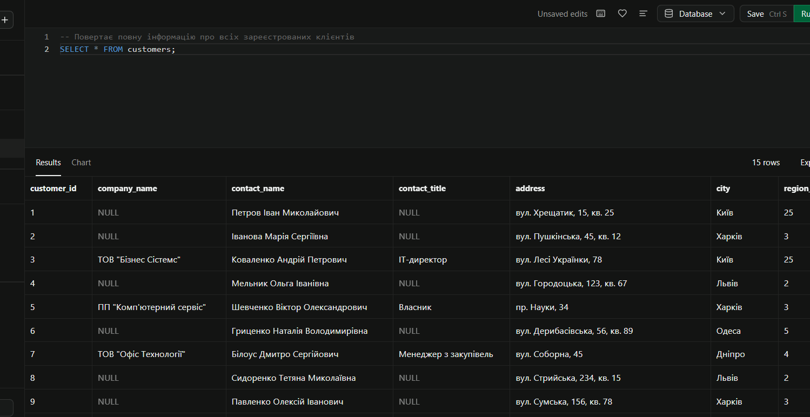
Отримано всі записи клієнтів, включаючи як фізичних осіб, так і юридичні особи.

 1.2. Вивести тільки назви товарів і їхні ціни з таблиці products
 
 ```sql
 -- Отримання каталогу товарів із зазначенням вартості
SELECT product_name, unit_price FROM products;
```
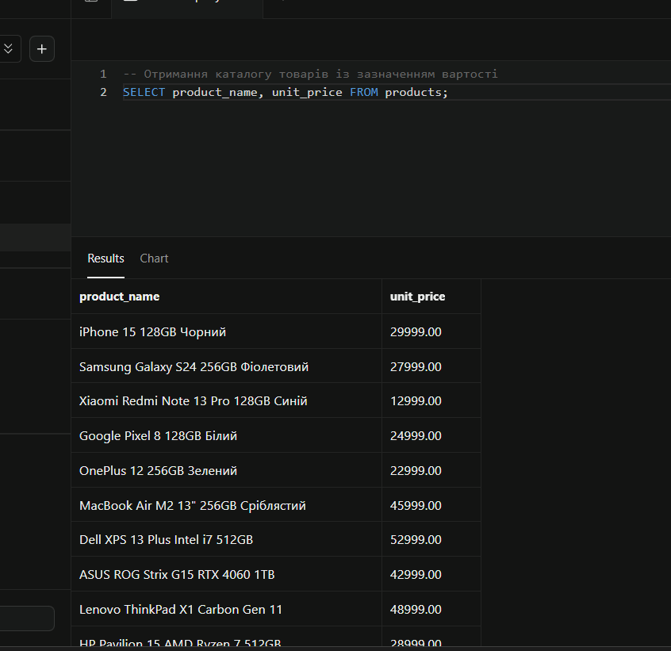
Отримано перелік товарів із зазначенням їхньої ціни.

 1.3. Показати контактні дані всіх співробітників
 ```sql
 -- Отримання контактного списку працівників
SELECT first_name, last_name, phone, email FROM employees;
```
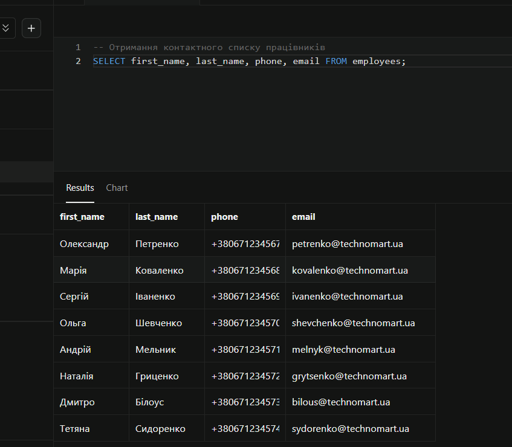
Отримано список усіх працівників компанії з їхніми номерами телефонів та електронними адресами.

2. Прості умови WHERE
  ```sql
1.4. Знайти всіх клієнтів з міста Київ
-- Фільтрація клієнтської бази за містом Київ
SELECT * FROM customers WHERE city = 'Київ';
```
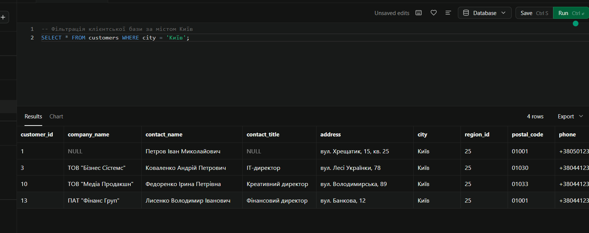
Знайдено та виведено тільки тих клієнтів, у яких у полі city вказано "Київ".

1.5. Вивести товари, які коштують більше 25000 грн
-- Пошук товарів високої цінової категорії
SELECT product_name, unit_price FROM products WHERE unit_price > 25000;
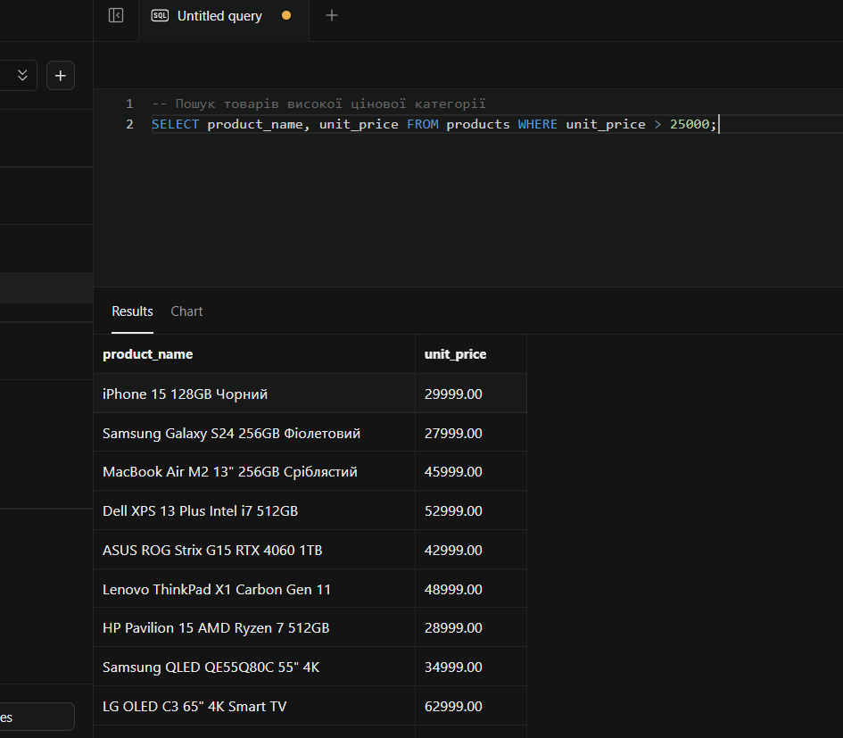
Відображено перелік товарів, ціна яких перевищує 25000 грн.

1.6. Показати всі відправлені замовлення (де вказана дата відправки)
-- Отримання списку замовлень, які мають вказану дату відправки
SELECT order_id, customer_id, order_date, shipped_date 
FROM orders 
WHERE shipped_date IS NOT NULL;
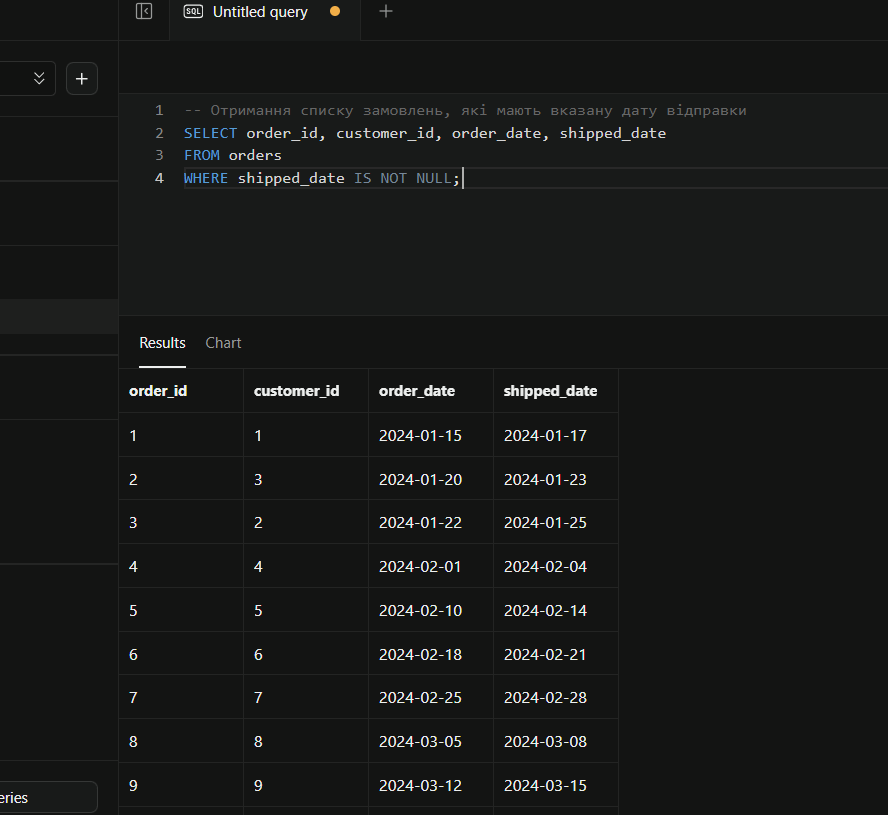
Виведено список усіх замовлень, які були успішно відправлені клієнтам.

1.7. Знайти співробітників, які працюють у відділі продажів
-- Пошук співробітників, посада яких містить слово "продаж"
SELECT first_name, last_name, title FROM employees WHERE title ILIKE '%продаж%';
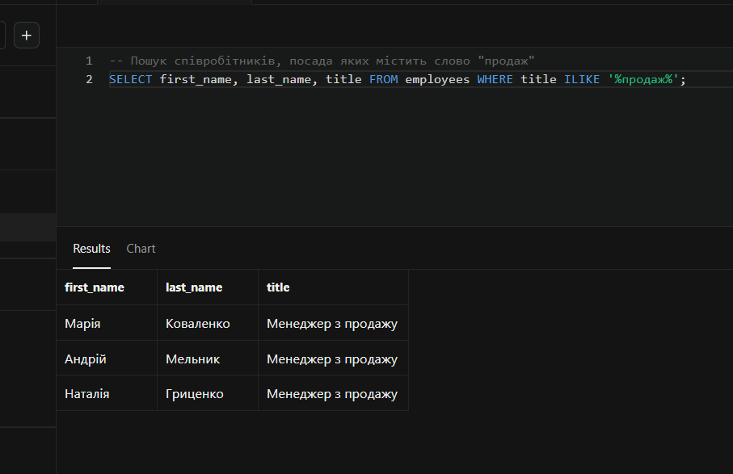
Виведено співробітників, у назві посади яких присутнє слово "продаж".

3. Базове сортування ORDER BY
1.8. Відсортувати товари за зростанням ціни
-- Сортування каталогу від найдешевших товарів до найдорожчих
SELECT product_name, unit_price FROM products ORDER BY unit_price ASC;
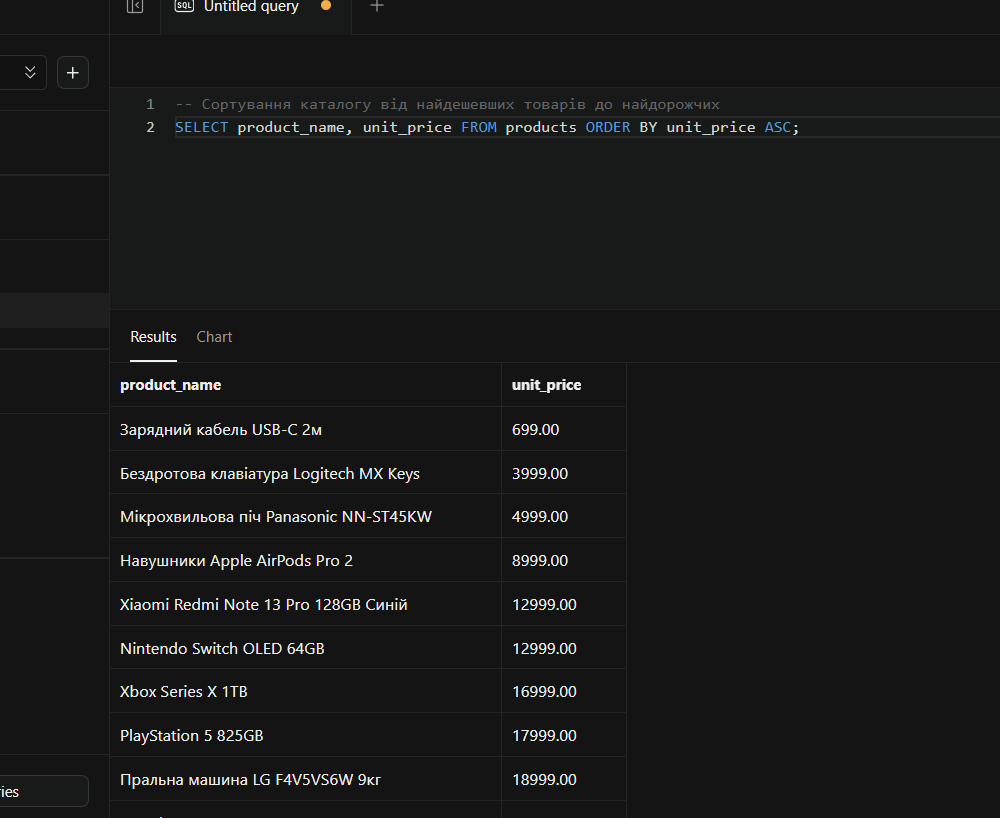
Отримано каталог товарів, впорядкований від найменшої ціни до найбільшої.

1.9. Показати клієнтів в алфавітному порядку за іменем контактної особи
-- Упорядкування клієнтів за ПІБ контактної особи (А-Я)
SELECT contact_name, city, phone FROM customers ORDER BY contact_name ASC;
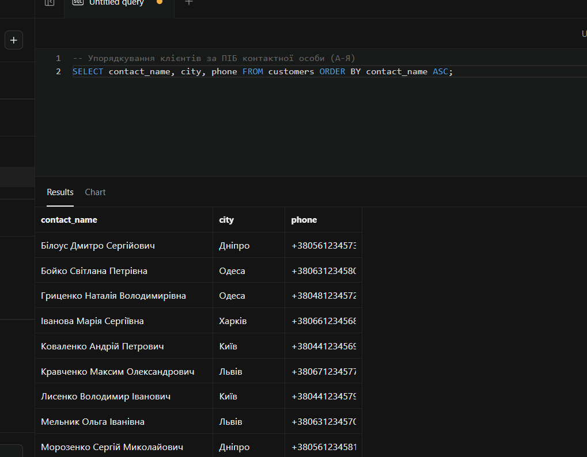
Список клієнтів впорядковано за алфавітом за полем contact_name.

1.10. Вивести замовлення від найновіших до найстаріших

-- Сортування замовлень за датою створення у зворотному порядку
SELECT order_id, order_date, customer_id, shipped_date FROM orders ORDER BY order_date DESC;
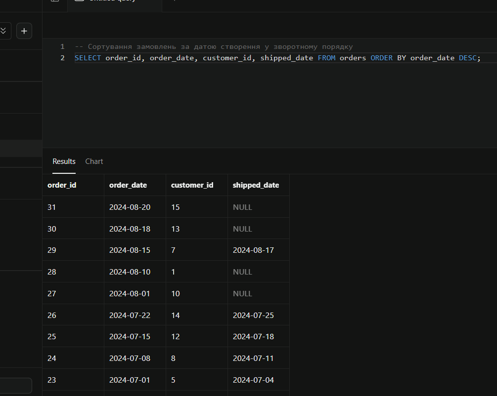
Замовлення відсортовані за хронологічним спаданням (спочатку найновіші).

4. Обмеження результатів LIMIT
1.11. Показати перші 10 найдорожчих товарів
-- Визначення ТОП-10 найдорожчих позицій асортименту
SELECT product_name, unit_price FROM products ORDER BY unit_price DESC LIMIT 10;
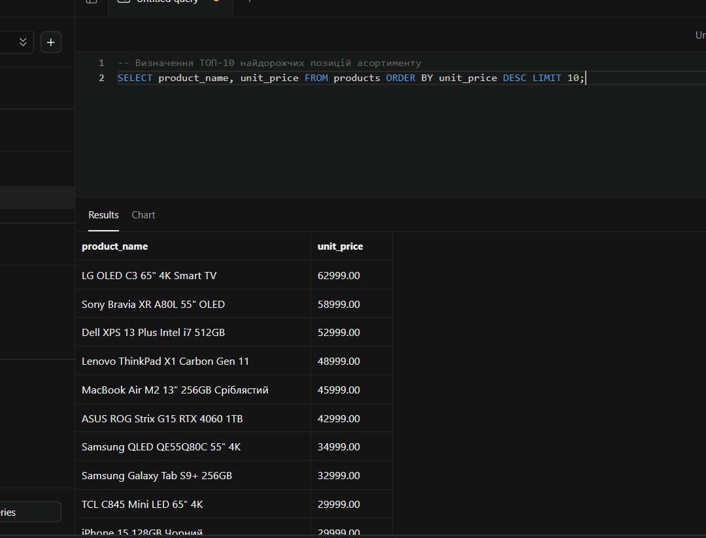
Отримано рівно 10 записів із найвищою вартістю товару.

1.12. Вивести 5 останніх замовлень (за датою)
-- Отримання 5 найновіших замовлень у системі
SELECT order_id, order_date, customer_id, shipped_date FROM orders ORDER BY order_date DESC LIMIT 5;
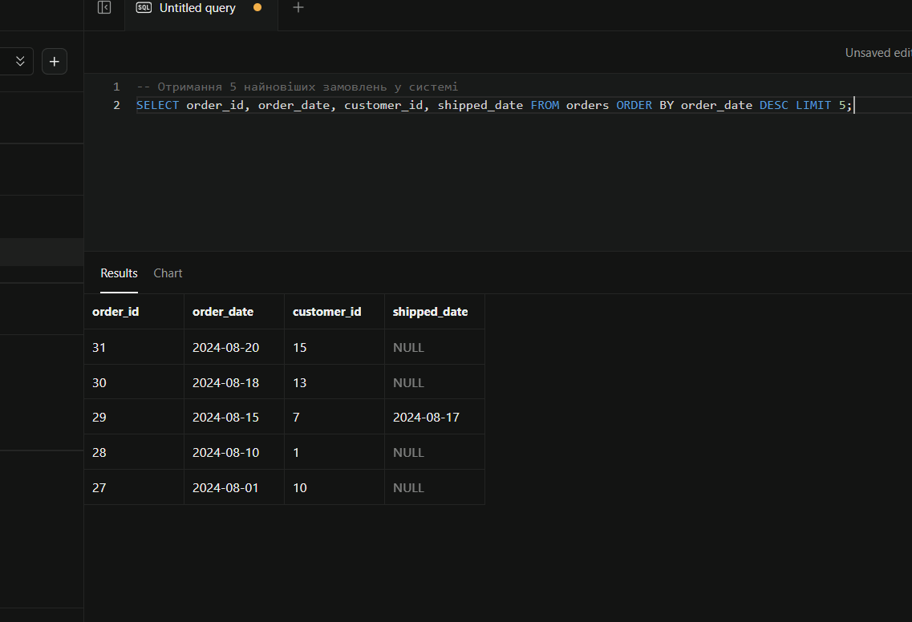
Повернуто 5 останніх сформованих замовлень.

1.13. Отримати перших 8 клієнтів в алфавітному порядку
-- Перші 8 клієнтів у списку за алфавітом
SELECT contact_name, city FROM customers ORDER BY contact_name ASC LIMIT 8;
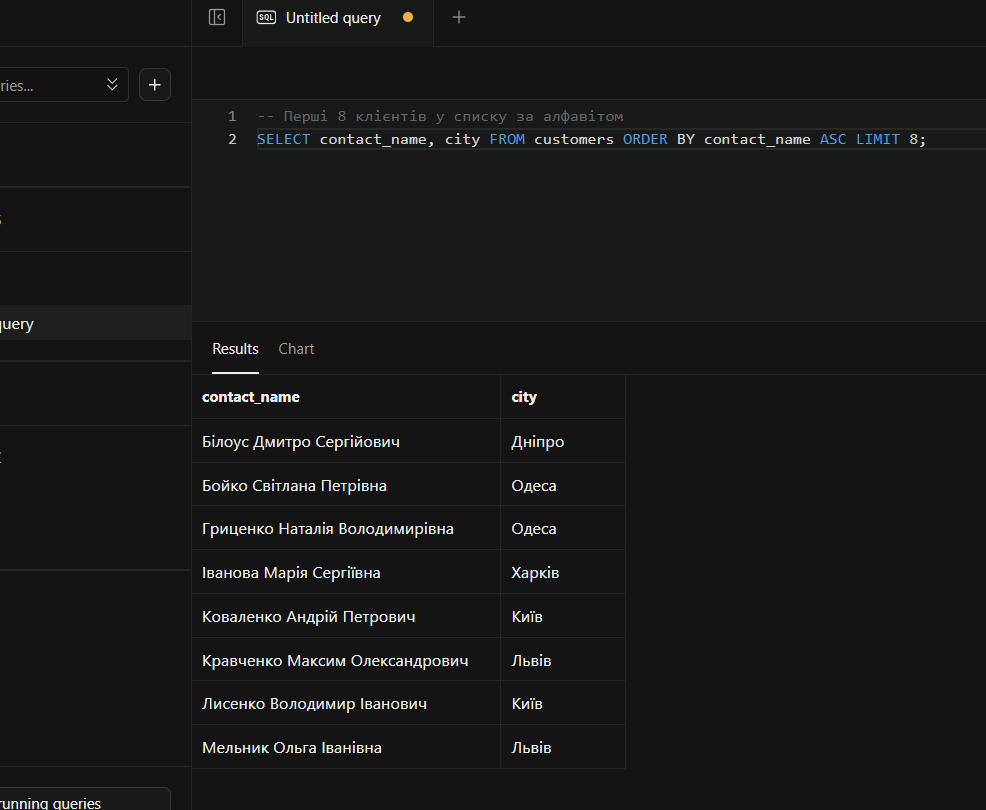
Виведено перші 8 клієнтів за алфавітним списком.

РІВЕНЬ 2 (Додаткові завдання та самостійна робота)
1. Пошук за зразком з LIKE / ILIKE
2.1. Знайти всіх клієнтів, чиї імена починаються на "Іван"
-- Пошук клієнтів з ім'ям Іван (нечутливий до регістру)
SELECT * FROM customers WHERE contact_name ILIKE 'Іван%';
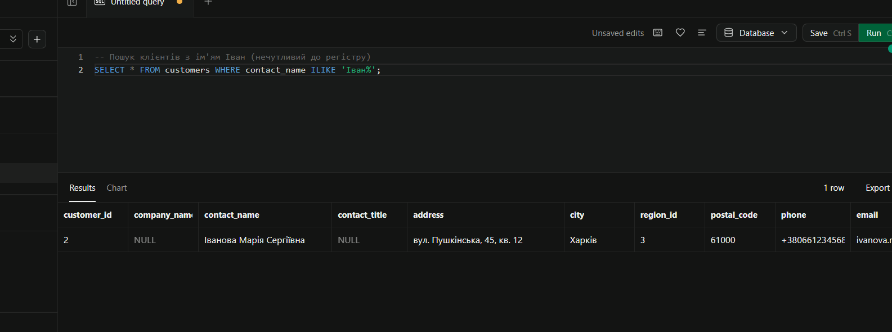
Виведено клієнтів, чиє ім'я починається на "Іван".

2.2. Вивести товари, в назві яких є слово "phone" або "телефон"
-- Пошук смартфонів та телефонів в асортименті
SELECT product_name, unit_price FROM products WHERE product_name ILIKE '%phone%' OR product_name ILIKE '%телефон%';
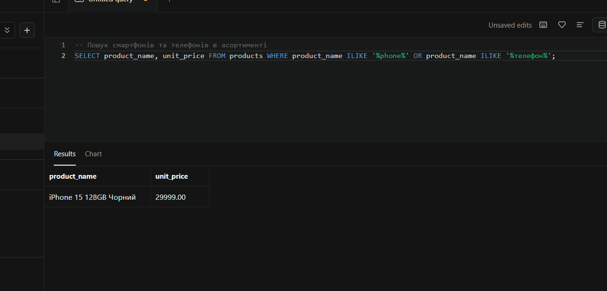
Повернуто всі товари, у назві яких наявні вказані ключові слова.

2.3. Самостійні запити з LIKE 
-- 1. Бізнес-логіка: Пошук клієнтів з поштою Gmail для формування списку маркетингової розсилки
SELECT contact_name, email FROM customers WHERE email LIKE '%@gmail.com';
-- 2. Бізнес-логіка: Пошук усіх аксесуарів типу "чохол" для формування акційного комплекту
SELECT product_name, unit_price FROM products WHERE product_name ILIKE '%чохол%';
-- 3. Бізнес-логіка: Пошук співробітників, ім'я яких починається на "О" для формування списку чергування
SELECT first_name, last_name, title FROM employees WHERE first_name ILIKE 'О%';
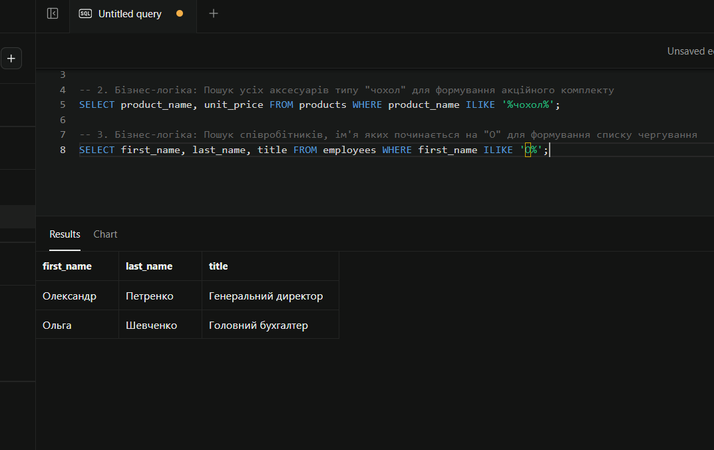
Успішно виконано 3 власні запити на пошук за кінцем, умістом та початком рядка.

2. Логічні оператори AND, OR, NOT
2.4. Знайти товари дорожчі за 15000 грн і дешевші за 50000 грн
-- Вибірка товарів середнього цінового сегменту
SELECT product_name, unit_price FROM products WHERE unit_price > 15000 AND unit_price < 50000;
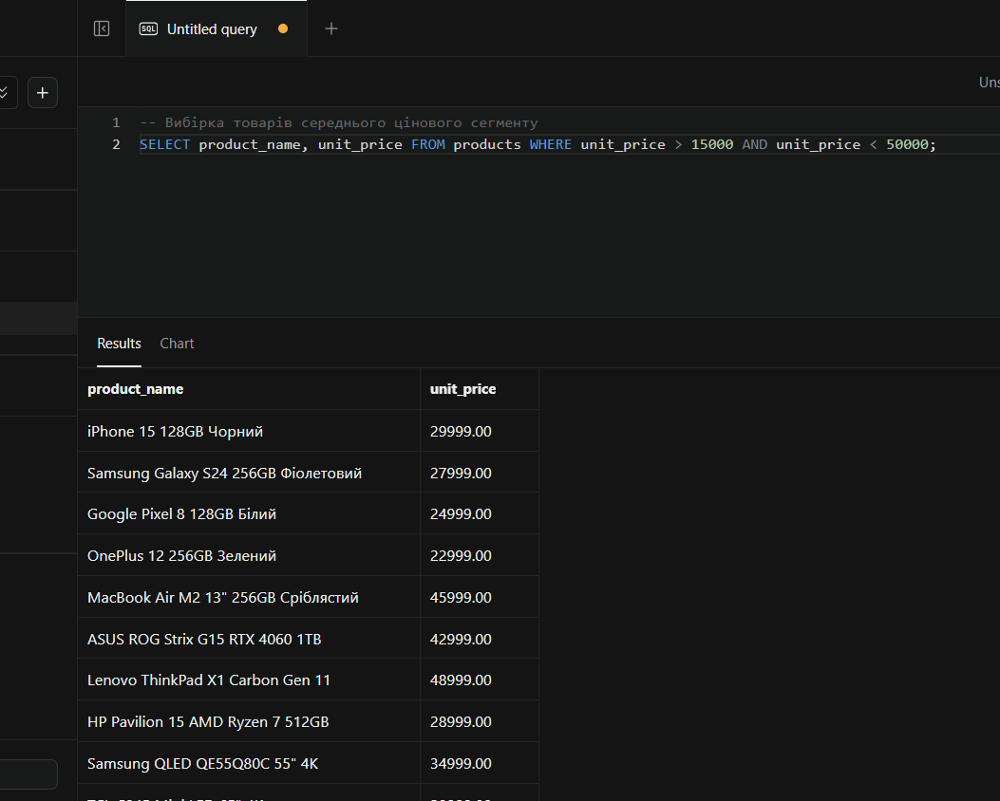
Виведено товари з ціновою вилкою від 15000 до 50000 грн.

2.5. Вивести клієнтів з Києва або Львова, які є юридичними особами
-- Пошук корпоративних клієнтів у ключових регіонах
SELECT contact_name, city, customer_type FROM customers WHERE (city = 'Київ' OR city = 'Львів') AND customer_type = 'company';
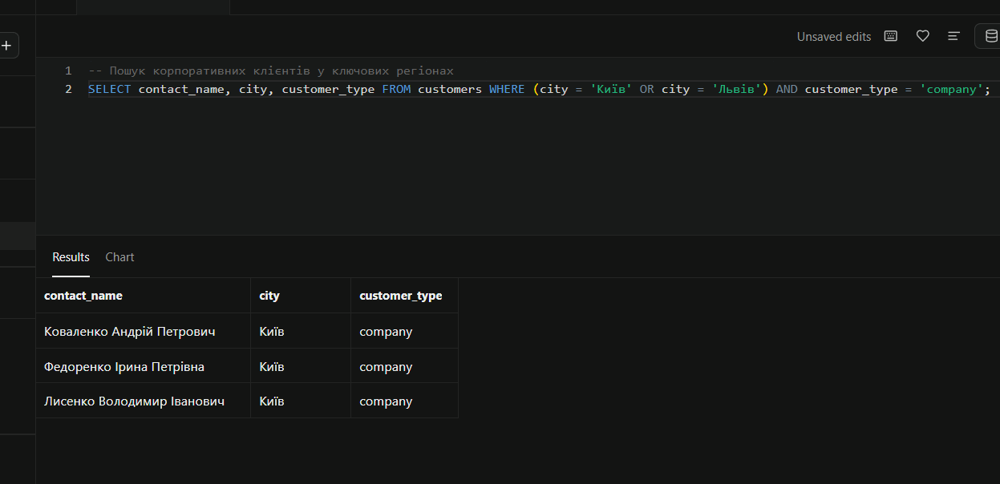
Отримано компанії, зареєстровані в Києві або Львові.

2.6. Самостійні запити з комбінаціями операторів (4 запити)
-- 1. Бізнес-логіка: Пошук активних товарів (не знятих з виробництва), які є на складі
SELECT product_name, units_in_stock FROM products WHERE NOT discontinued AND units_in_stock > 0;

-- 2. Бізнес-логіка: Фізичні особи не з Києва для розрахунку вартості міжміської доставки
SELECT contact_name, city, customer_type FROM customers WHERE customer_type = 'person' AND NOT city = 'Київ';

-- 3. Бізнес-логіка: Знайти замовлення за 2024 рік, які були відправлені покупцю
SELECT order_id, order_date, shipped_date FROM orders WHERE order_date >= '2024-01-01' AND shipped_date IS NOT NULL;

-- 4. Бізнес-логіка: Бюджетні товари категорій 1 або 3 ціною до 10000 грн
SELECT product_name, category_id, unit_price FROM products WHERE (category_id = 1 OR category_id = 3) AND unit_price < 10000;
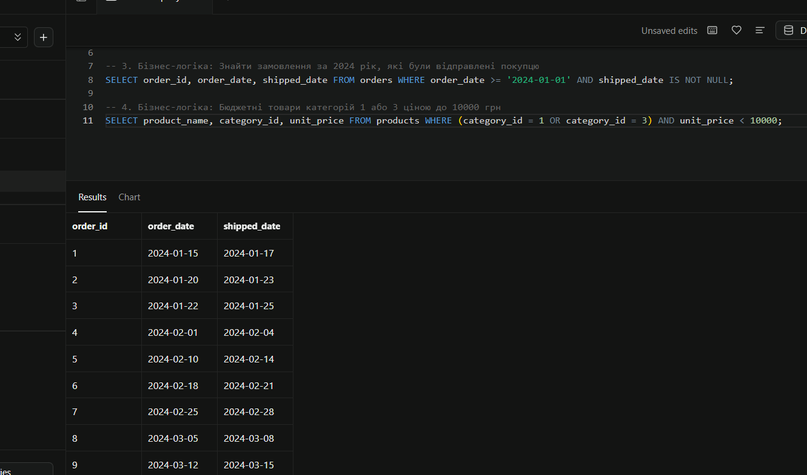
Отримано відфільтровані дані за кількома комбінованими умовами.

3. Оператори IN, BETWEEN, IS NULL
2.7. Вивести клієнтів з міст Київ, Харків, Одеса, Дніпро
-- Вибірка клієнтів із міст-мільйонників
SELECT contact_name, city FROM customers WHERE city IN ('Київ', 'Харків', 'Одеса', 'Дніпро');
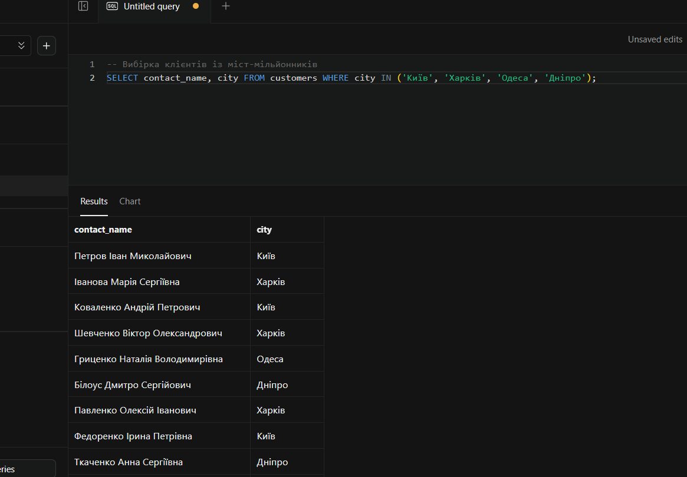
Отримано список клієнтів із зазначених великих міст.

2.8. Знайти товари в ціновому діапазоні від 10000 до 30000 грн
-- Пошук товарів у ціновому діапазоні (включно)
SELECT product_name, unit_price FROM products WHERE unit_price BETWEEN 10000 AND 30000;
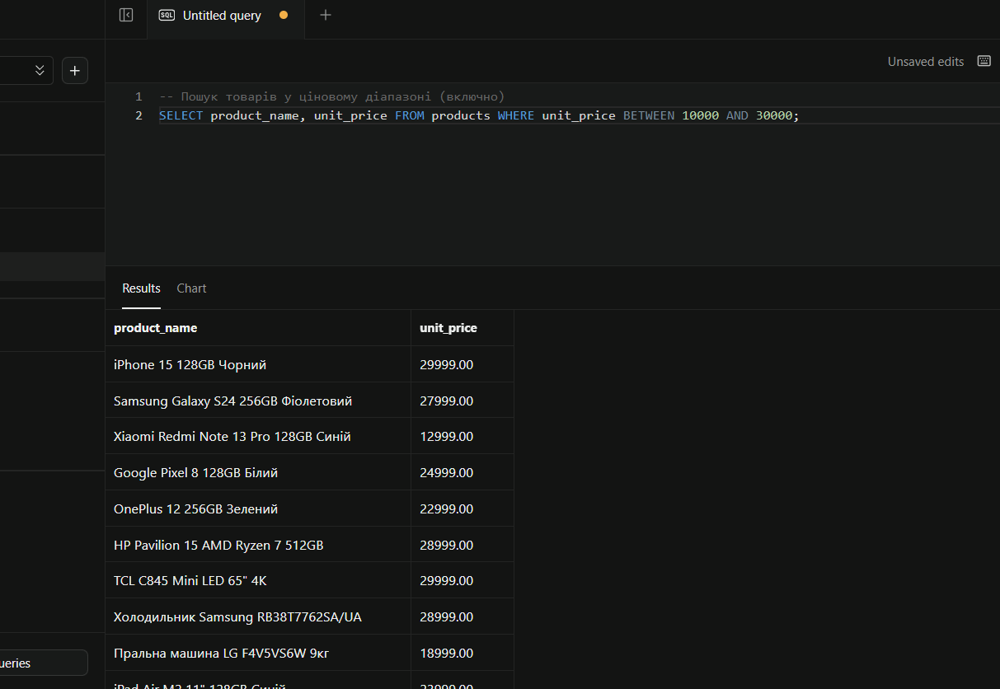
Повернуто товари, що входять у зазначений ціновий інтервал.

2.9. Самостійні запити для IN, BETWEEN, IS NULL (6 запитів)
-- 1. Оператор IN: Товари з конкретних категорій (1, 2, 5) для проведення акції
SELECT product_name, category_id, unit_price FROM products WHERE category_id IN (1, 2, 5);

-- 2. Оператор IN: Клієнти з західних обласних центрів
SELECT contact_name, city FROM customers WHERE city IN ('Львів', 'Івано-Франківськ', 'Тернопіль', 'Луцьк');

-- 3. Оператор BETWEEN: Замовлення за перший квартал 2024 року
SELECT order_id, order_date FROM orders WHERE order_date BETWEEN '2024-01-01' AND '2024-03-31';

-- 4. Оператор BETWEEN: Товари з помірним залишком на складі (від 10 до 50 шт)
SELECT product_name, units_in_stock FROM products WHERE units_in_stock BETWEEN 10 AND 50;

-- 5. Оператор IS NULL: Невідправлені замовлення (дата відправки ще не заповнена)
SELECT order_id, order_date FROM orders WHERE shipped_date IS NULL;

-- 6. Оператор IS NOT NULL: Юридичні особи із заповненою назвою компанії
SELECT contact_name, company_name FROM customers WHERE company_name IS NOT NULL;
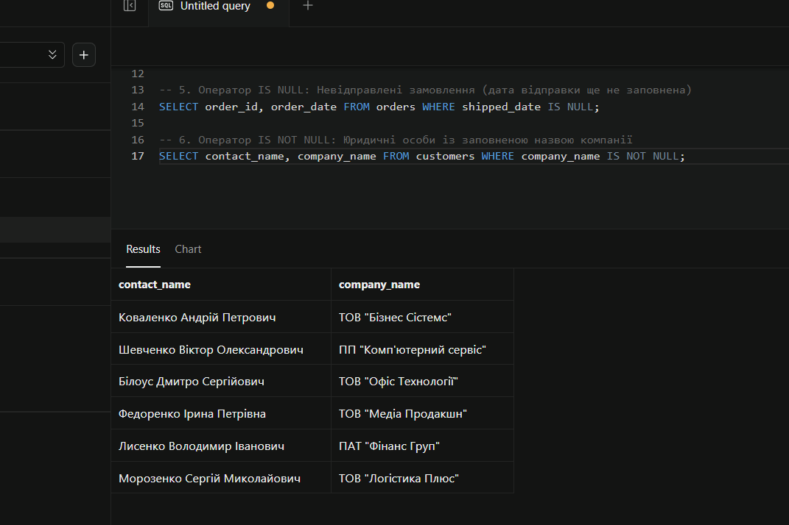
Успішно реалізовано запити на вибірку за списками, діапазонами та наявністю NULL-значень.

4. Комбінування умов (5 складних запитів)
2.10. Самостійні складні комбіновані запити
-- 1. LIKE + AND + IN: Смартфони Apple/Samsung із категорій 1 або 2
SELECT product_name, unit_price FROM products WHERE (product_name ILIKE '%Apple%' OR product_name ILIKE '%Samsung%') AND category_id IN (1, 2);

-- 2. BETWEEN + IN + NOT: Активні товари ціною від 5000 до 20000 грн з категорій 1, 3, 4
SELECT product_name, unit_price, category_id FROM products WHERE (unit_price BETWEEN 5000 AND 20000) AND category_id IN (1, 3, 4) AND NOT discontinued;

-- 3. IS NOT NULL + ILIKE + OR: Клієнти з вказаним емейлом з Одеси або з іменем "Олекс"
SELECT contact_name, city, email FROM customers WHERE email IS NOT NULL AND (contact_name ILIKE '%Олекс%' OR city = 'Одеса');

-- 4. BETWEEN + IS NULL: Замовлення за 2024 рік, які ще не були відправлені
SELECT order_id, order_date FROM orders WHERE (order_date BETWEEN '2024-01-01' AND '2024-12-31') AND shipped_date IS NULL;

-- 5. IN + NOT LIKE + AND: Товари категорій 1, 2 без чохлів та кабелів, які є на складі
SELECT product_name, unit_price, units_in_stock FROM products WHERE category_id IN (1, 2) AND product_name NOT ILIKE '%кабель%' AND product_name NOT ILIKE '%чохол%' AND units_in_stock > 0;
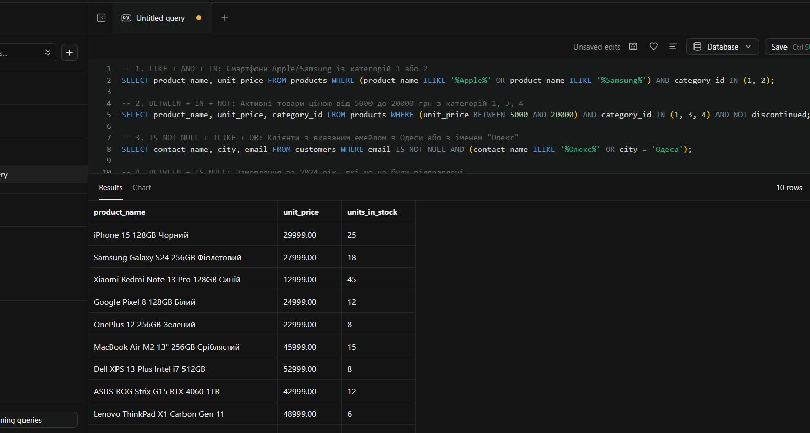
Сформовано 5 складних запитів із групуванням умов дужками.
5. Складне сортування та пагінація
2.11. Багаторівневе сортування (3 запити)
-- 1. Сортування товарів за категорією (ASC), та ціною в межах категорії від найдорожчих (DESC)
SELECT category_id, product_name, unit_price FROM products ORDER BY category_id ASC, unit_price DESC;

-- 2. Впорядкування клієнтів за типом, потім за містом і за іменем
SELECT customer_type, city, contact_name FROM customers ORDER BY customer_type ASC, city ASC, contact_name ASC;

-- 3. Сортування замовлень за датою (від найновіших) та датою відправки
SELECT order_id, order_date, shipped_date FROM orders ORDER BY order_date DESC, shipped_date DESC NULLS LAST;
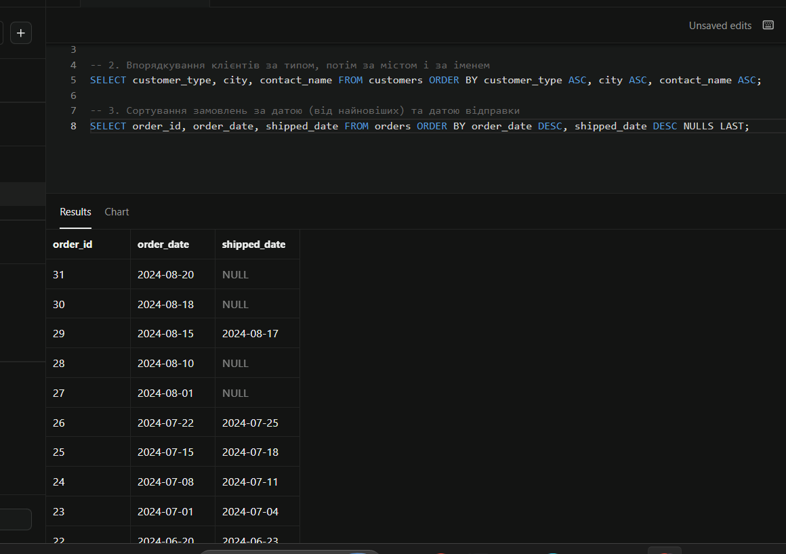
Отримано відсортовані списки за кількома текстовими та числовими полями.

2.12. Пагінація з OFFSET (2 запити)
-- 1. Показ другої сторінки товарів (по 10 товарів на сторінку)
SELECT product_name, unit_price FROM products ORDER BY product_name ASC LIMIT 10 OFFSET 10;

-- 2. Показ третьої сторінки списку замовлень (по 5 замовлень на сторінку)
SELECT order_id, order_date, customer_id FROM orders ORDER BY order_date DESC LIMIT 5 OFFSET 10;
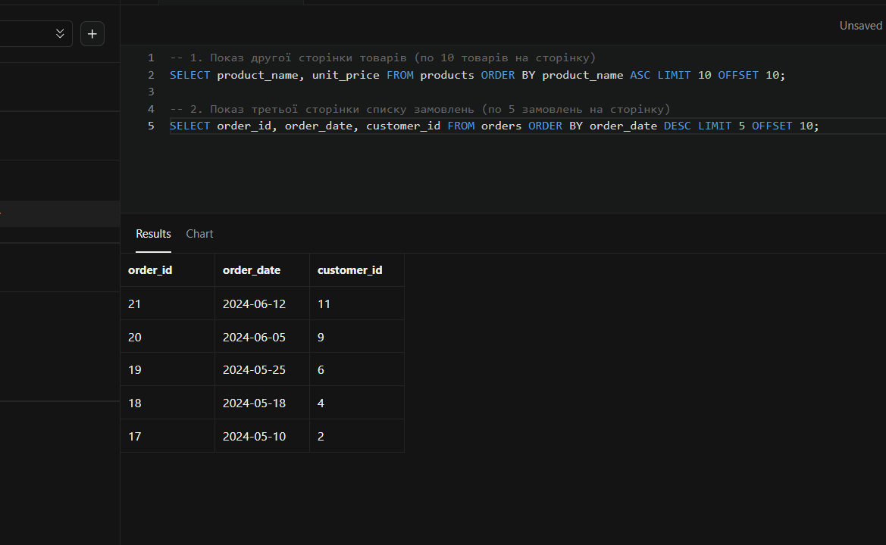
Успішно реалізовано механізм сторінкового виводу (пагінації).

## Висновки
Самооцінка: 4 (Достатній рівень)

Обґрунтування: У ході лабораторної роботи повністю виконані всі завдання Рівня 1 та Рівня 2. Опановано написання стандартних DQL-запитів SELECT, застосування фільтрації за допомогою WHERE, LIKE/ILIKE, IN, BETWEEN, IS NULL, а також реалізовано складне сортування та пагінацію результатів через LIMIT і OFFSET. Усі самостійні запити доповнені коментарями та описом бізнес-логіки.
