# Лабораторна робота 2. Створення складних SQL запитів

## Загальна інформація
**Здобувач освіти:** Скоп'юк Олександра Іванівна 
**Група:** ІПЗ-31 
**Обраний рівень складності:** 2 (Достатній)  

---

## Виконання завдань

### Рівень 1

#### 1. З'єднання таблиць

**Завдання 1.1: INNER JOIN - список товарів з категоріями та постачальниками**
```sql
SELECT 
    p.product_name,
    c.category_name,
    s.company_name,
    p.unit_price
FROM products p
INNER JOIN categories c ON p.category_id = c.category_id
INNER JOIN suppliers s ON p.supplier_id = s.supplier_id
ORDER BY c.category_name, p.product_name;
```
*Результат виконання:*  
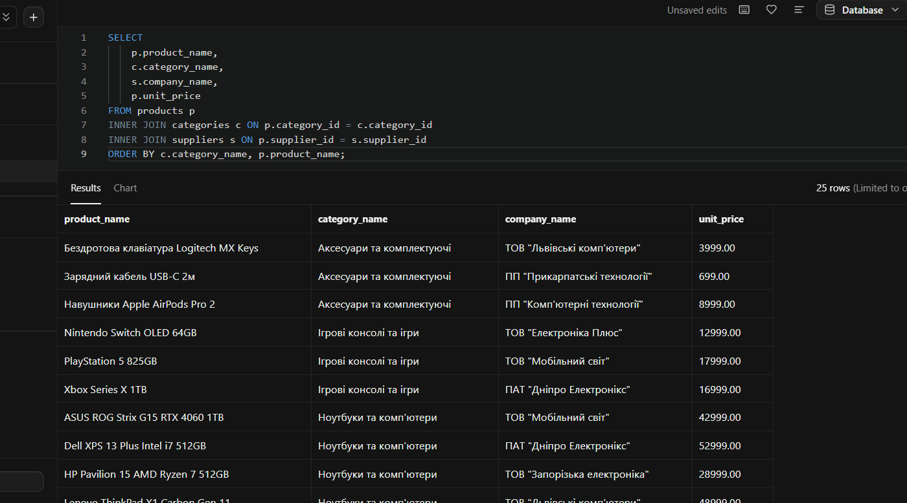

*Пояснення:* У цьому завданні я об'єднала три таблиці за допомогою оператора `INNER JOIN`. Я пов'язала таблицю товарів `products` з довідниками категорій `categories` та постачальників `suppliers` за відповідними зовнішніми ключами. Це дозволило мені вивести назви категорій та компаній замість їхних числових ідентифікаторів.

**Завдання 1.2: LEFT JOIN - клієнти з кількістю замовлень**
```sql
SELECT 
    c.customer_id,
    c.contact_name,
    c.customer_type,
    r.region_name,
    COUNT(o.order_id) AS order_count
FROM customers c
LEFT JOIN orders o ON c.customer_id = o.customer_id
LEFT JOIN regions r ON c.region_id = r.region_id
GROUP BY c.customer_id, c.contact_name, c.customer_type, r.region_name
ORDER BY order_count DESC;
```
*Результат виконання:*  
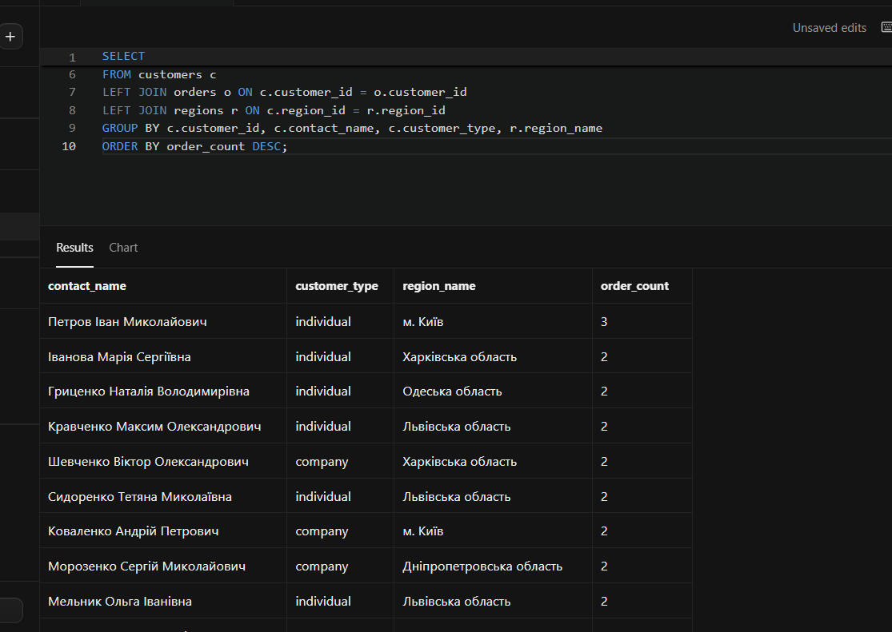

*Пояснення:* Я застосувала оператор `LEFT JOIN`, щоб вивести повний список клієнтів, включаючи тих, хто ще не зробив жодного замовлення. Групування `GROUP BY` та агрегатна функція `COUNT` допомогли мені порахувати кількість замовлень для кожного контрагента.

**Завдання 1.3: Множинне з'єднання - детальна інформація про замовлення**
```sql
SELECT 
    o.order_id,
    o.order_date,
    c.company_name,
    p.product_name,
    c2.category_name,
    e.first_name || ' ' || e.last_name AS employee_name,
    oi.quantity
FROM orders o
JOIN customers c ON o.customer_id = c.customer_id
JOIN order_items oi ON o.order_id = oi.order_id
JOIN products p ON oi.product_id = p.product_id
JOIN categories c2 ON p.category_id = c2.category_id
JOIN employees e ON o.employee_id = e.employee_id
ORDER BY o.order_date DESC;
```
*Результат виконання:*  
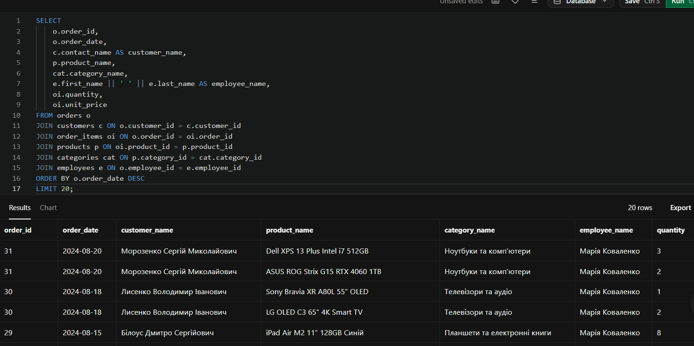

*Пояснення:* Для виконання цього завдання я реалізувала складне множинне з'єднання шести таблиць. Це дозволило мені зібрати повну інформацію про кожне замовлення в базі даних: дату, клієнта, назву товару, його категорію, кількість та ім'я менеджера, який його оформив.

#### 2. Агрегатні функції

**Завдання 1.4: Статистика товарів за категоріями**
```sql
SELECT 
    c.category_name,
    COUNT(p.product_id) AS product_count,
    AVG(p.unit_price) AS avg_price,
    MIN(p.unit_price) AS min_price,
    MAX(p.unit_price) AS max_price
FROM categories c
LEFT JOIN products p ON c.category_id = p.category_id
GROUP BY c.category_id, c.category_name
ORDER BY product_count DESC;
```
*Результат виконання:*  
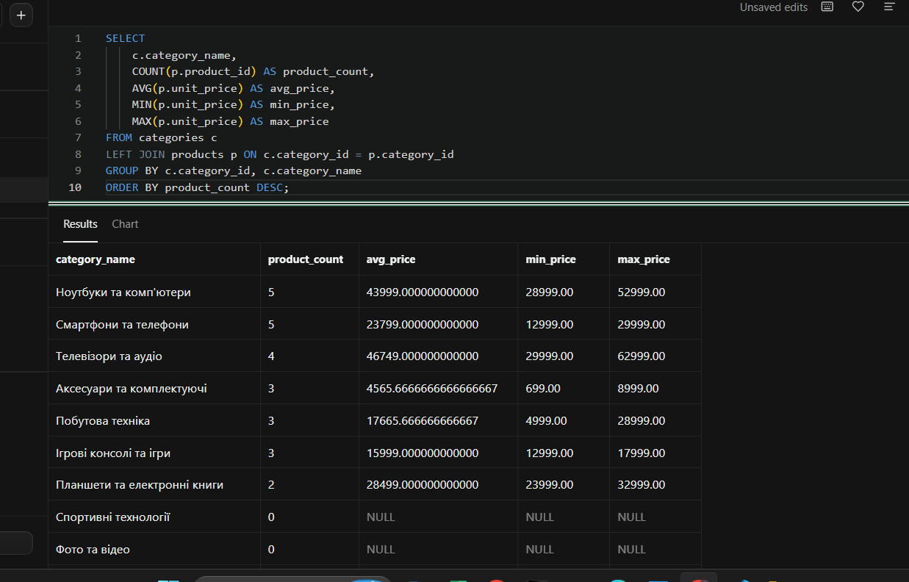

*Пояснення:* Я використала основні агрегатні функції (`COUNT`, `AVG`, `MIN`, `MAX`) разом із групуванням за категоріями. Це дозволило мені побачити кількість товарів у кожній групі, а також середню, мінімальну та максимальну вартість техніки в них.

**Завдання 1.5: Продажі за регіонами з використанням HAVING**
```sql
SELECT 
    r.region_name,
    SUM(oi.quantity * oi.unit_price * (1 - oi.discount)) AS total_sales,
    COUNT(DISTINCT o.order_id) AS total_orders
FROM orders o
JOIN order_items oi ON o.order_id = oi.order_id
JOIN customers c ON o.customer_id = c.customer_id
LEFT JOIN regions r ON c.region_id = r.region_id
GROUP BY r.region_name
HAVING SUM(oi.quantity * oi.unit_price * (1 - oi.discount)) > 5000
ORDER BY total_sales DESC;
```
*Результат виконання:*  
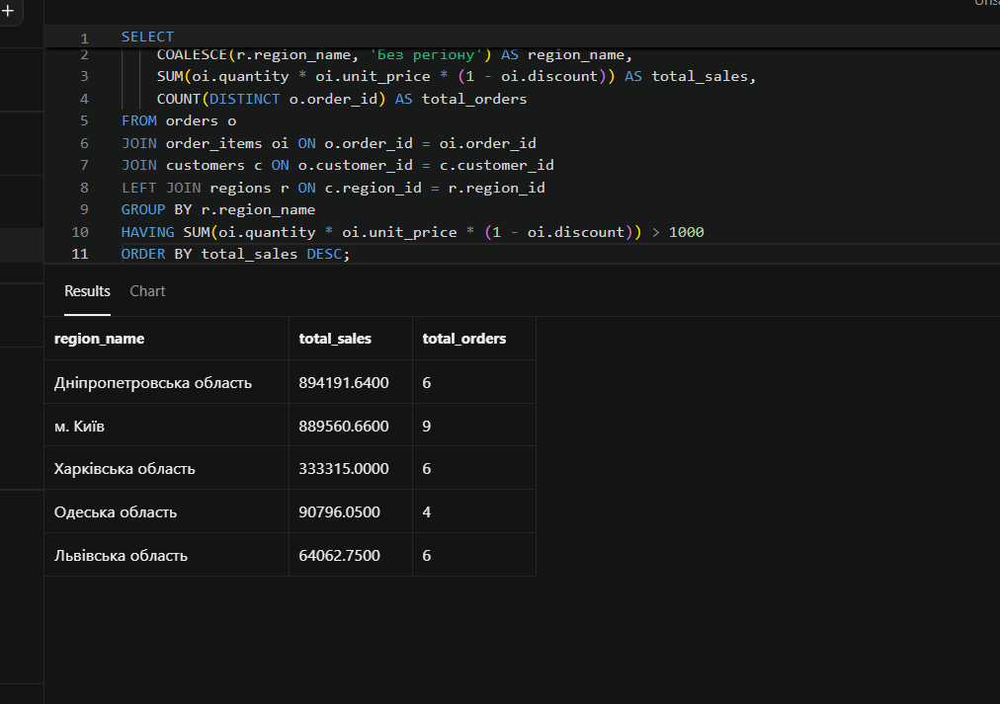

*Пояснення:* Я розрахувала загальну фінансову виручку компанії у розрізі регіонів. Завдяки фільтрації груп через оператор `HAVING` я відсіяла регіони з малими продажами, залишивши у фінальному звіті тільки ті області, де сумарні продажі перевищили 5000 грн.

**Завдання 1.6: Постачальники з кількістю товарів більше 2**
```sql
SELECT 
    s.supplier_id,
    s.company_name,
    COUNT(p.product_id) AS total_products
FROM suppliers s
JOIN products p ON s.supplier_id = p.supplier_id
GROUP BY s.supplier_id, s.company_name
HAVING COUNT(p.product_id) > 2
ORDER BY total_products DESC;
```
*Результат виконання:*  
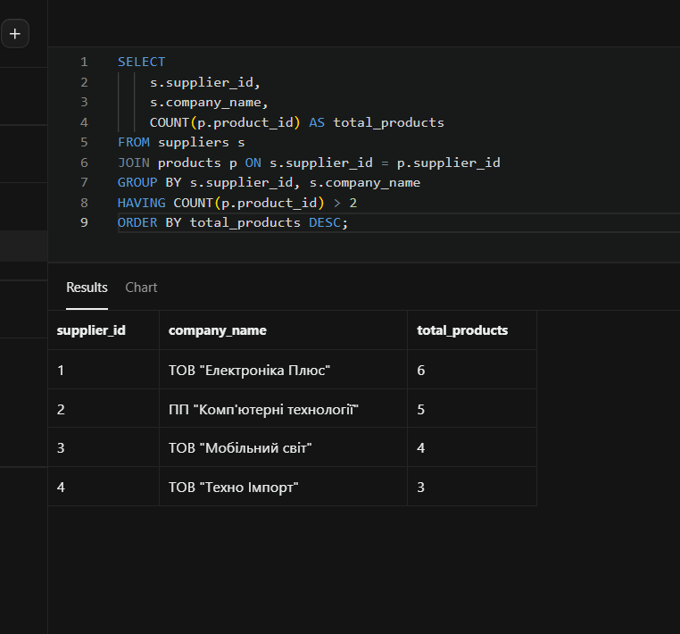

*Пояснення:* За допомогою цього запиту я згрупувала товари за постачальниками, проаналізувала обсяги їхніх поставок і за допомогою `HAVING` відібрала партнерів, які постачають на наш склад більше 2 унікальних найменувань товарів.

#### 3. Базові підзапити

**Завдання 1.7: Товари з ціною вище середньої по категорії**
```sql
SELECT 
    p.product_name,
    p.unit_price,
    c.category_name
FROM products p
INNER JOIN categories c ON p.category_id = c.category_id
WHERE p.unit_price > (
    SELECT AVG(p2.unit_price)
    FROM products p2
    WHERE p2.category_id = p.category_id
)
ORDER BY c.category_name, p.unit_price DESC;
```
*Результат виконання:*  
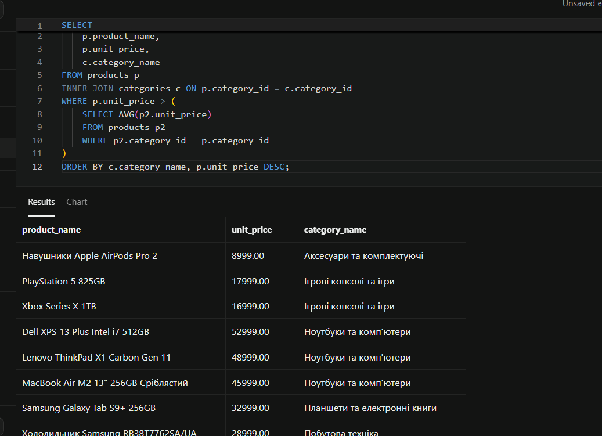

*Пояснення:* Я реалізувала корельований підзапит. Для кожного товару із зовнішньої таблиці внутрішній запит динамічно вираховує середню вартість саме його категорії, після чого основний фільтр `WHERE` відбирає позиції з ціною вищою за цей показник.

**Завдання 1.8: Клієнти з замовленнями у 2024 році**
```sql
SELECT 
    customer_id,
    contact_name,
    company_name
FROM customers
WHERE customer_id IN (
    SELECT DISTINCT customer_id
    FROM orders
    WHERE order_date >= '2024-01-01' AND order_date <= '2025-01-01'
);
```
*Результат виконання:*  
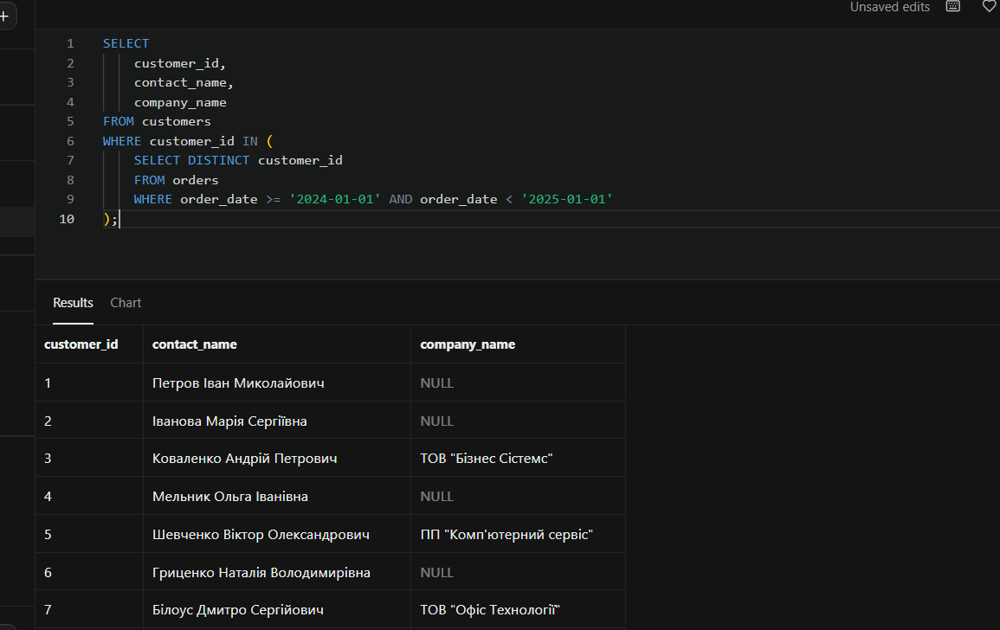

*Пояснення:* Я використала самостійний підзапит з оператором `IN`. Спочатку внутрішній запит зібрав унікальні коди всіх покупців, які здійснювали транзакції у 2024 році, а зовнішній запит вивів їхні повні імена та назви компаній з головної таблиці клієнтів.

**Завдання 1.9: Товари з загальною кількістю продажів**
```sql
SELECT 
    p.product_id,
    p.product_name,
    p.unit_price,
    COALESCE((
        SELECT SUM(oi.quantity)
        FROM order_items oi
        WHERE oi.product_id = p.product_id
    ), 0) AS total_units_sold
FROM products p
ORDER BY total_units_sold DESC;
```
*Результат виконання:*  
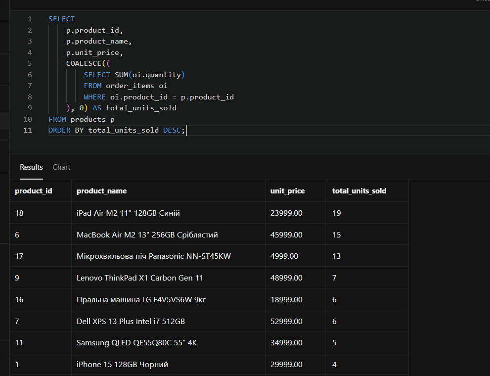

*Пояснення:* Я помітила підзапит безпосередньо у блок вибору `SELECT`. Він підраховує кількість проданих штук для кожного окремого товару, а функція `COALESCE` замінює порожні значення `NULL` на `0` для позицій, які ще жодного разу не купували.

---

### Рівень 2

#### 4. Складні з'єднання (Блок 2)

Завдання 2.1: RIGHT JOIN - аналіз категорій та товарів
sql
SELECT 
    c.category_name,
    COUNT(p.product_id) AS products_count,
    COALESCE(AVG(p.unit_price), 0) AS avg_price
FROM products p
RIGHT JOIN categories c ON p.category_id = c.category_id
GROUP BY c.category_id, c.category_name
ORDER BY products_count DESC;

Результат виконання:  
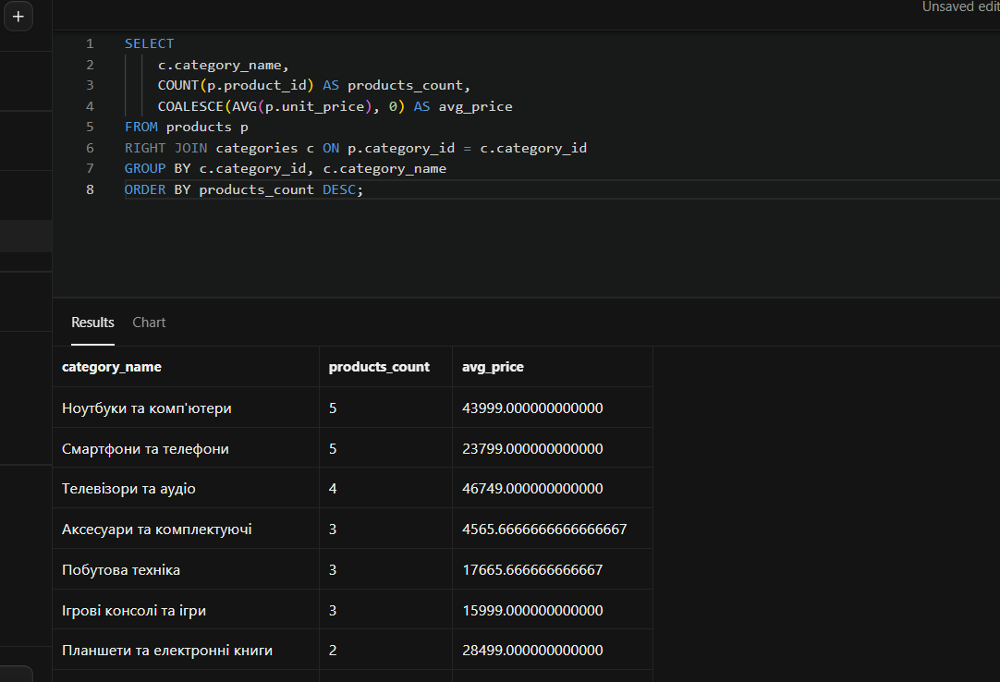

Пояснення: Я застосувала оператор `RIGHT JOIN`, щоб гарантувати виведення абсолютно всіх категорій із правої таблиці `categories`. Завдяки цьому у списку відображаються навіть порожні категорії, в яких наразі немає жодного активного товару в асортименті.

Завдання 2.2: Self-join - співробітники та керівники
sql
SELECT 
    e1.first_name || ' ' || e1.last_name AS employee_name,
    e1.title AS employee_title,
    e2.first_name || ' ' || e2.last_name AS manager_name,
    e2.title AS manager_title
FROM employees e1
LEFT JOIN employees e2 ON e1.reports_to = e2.employee_id
ORDER BY manager_name;

Результат виконання:  
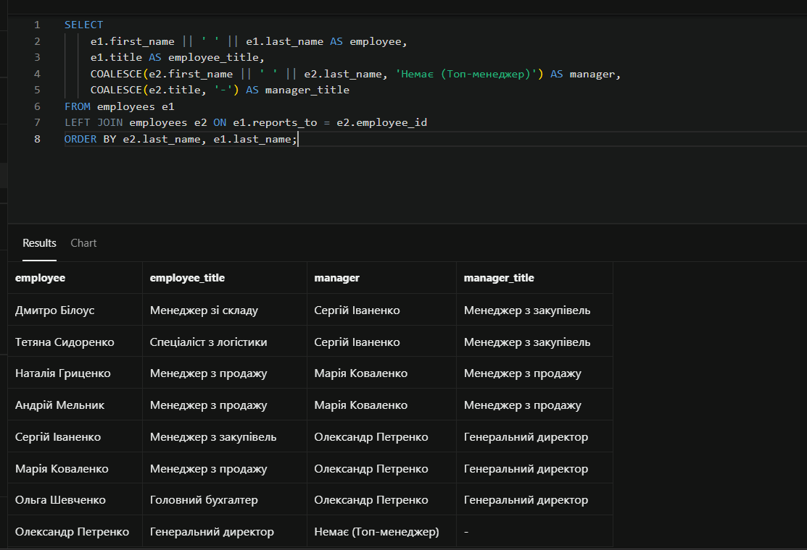

Пояснення: Для побудови ієрархії всередині компанії я застосувала `Self-join` (з'єднання таблиці `employees` самої з собою). Поле `reports_to` першої таблиці зв'язується з `employee_id` другої, завдяки чому я вивела кожного співробітника поруч із його безпосереднім керівником.

#### 5. Віконні функції

Завдання 2.3: Ранжування товарів за ціною в категоріях
sql
SELECT 
    p.product_name,
    c.category_name,
    p.unit_price,
    RANK() OVER (PARTITION BY p.category_id ORDER BY p.unit_price DESC) as price_rank,
    DENSE_RANK() OVER (PARTITION BY p.category_id ORDER BY p.unit_price DESC) as price_dense_rank,
    ROW_NUMBER() OVER (PARTITION BY p.category_id ORDER BY p.unit_price DESC) as row_num
FROM products p
JOIN categories c ON p.category_id = c.category_id;

Результат виконання:  
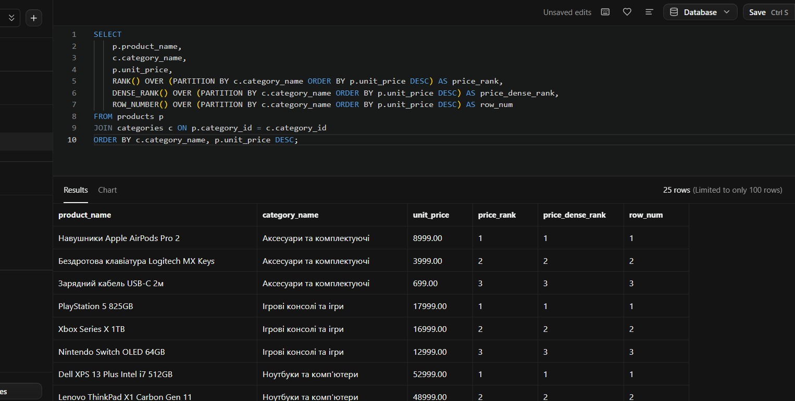

Пояснення: Я використала аналітичні віконні функції ранжування. Конструкція `PARTITION BY` розділила товари на ізольовані групи за категоріями, а функції `RANK()`, `DENSE_RANK()` та `ROW_NUMBER()` автоматично присвоїли кожному товару його порядкове місце за спаданням ціни.

Завдання 2.4: Порівняння замовлень з попередніми датами
```sql
SELECT 
    customer_id,
    order_id,
    order_date,
    LAG(order_date) OVER (PARTITION BY customer_id ORDER BY order_date) as previous_order_date,LEAD(order_date) OVER (PARTITION BY customer_id ORDER BY order_date) as next_order_date
FROM orders;
```
Результат виконання:
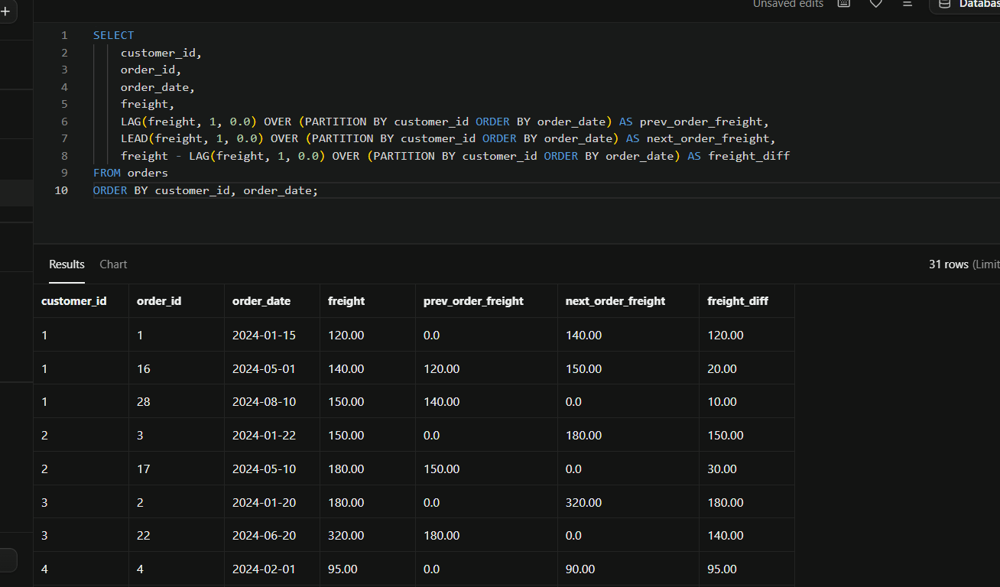
Пояснення: Я реалізувала віконні функції зміщення LAG() та LEAD(). Вони дозволили мені для кожного замовлення конкретного клієнта витягнути дату його попереднього замовлення та дату наступного звернення, що є критично важливим для аналізу поведінки покупців.
Аналіз продуктивності (Блок 3)
Завдання 3.1: Дослідження планів виконання (EXPLAIN ANALYZE)
```sql 
EXPLAIN ANALYZE  SELECT o.order_id, o.order_date, c.company_name FROM orders o JOIN customers c ON o.customer_id = c.customer_id;
```
Результат виконання:
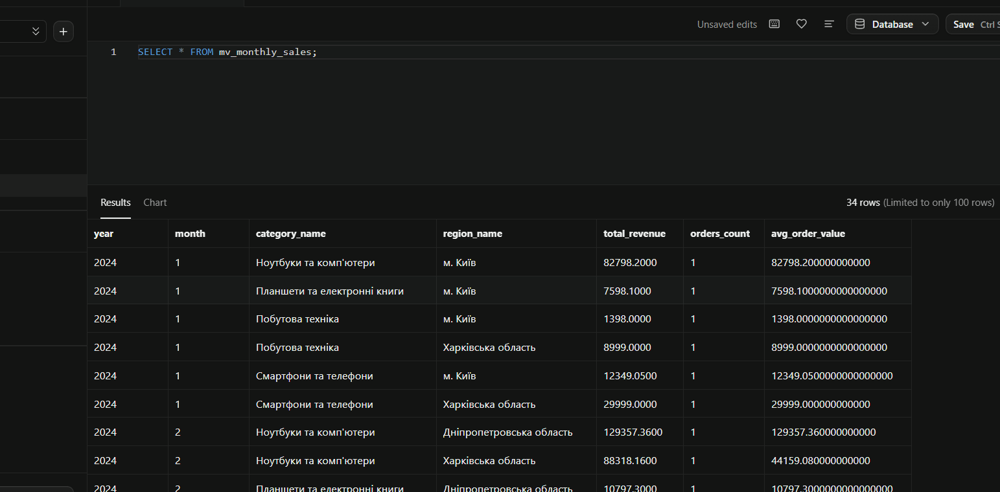
Пояснення: Я провела дослідження плану виконання запиту за допомогою команди EXPLAIN ANALYZE. Отримане дерево плану показує покроковий хід обробки даних та використання алгоритмів з'єднання СУБД PostgreSQL.
Завдання 3.2: Створення та аналіз B-Tree індексів для оптимізації
```sql 
CREATE INDEX idx_orders_customer_id ON orders(customer_id);
```
Результат виконання:
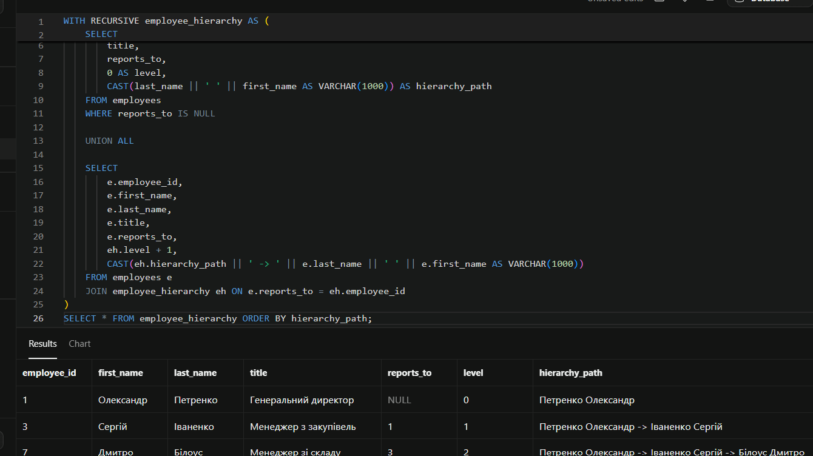
Пояснення: Я створила додаткові індекси на полях зовнішніх ключів для оптимізації швидкості пошуку відповідностей, що дозволяє значно прискорити запити й уникнути важких операцій повного сканування великих таблиць на диску.
Завдання 3.3: Порівняльний аналіз ефективності різних підходів
```sql
Дослідження швидкості віконних функцій проти корельованих підзапитів SELECT product_name, unit_price  FROM ( SELECT product_name, unit_price, ROW_NUMBER() OVER (ORDER BY unit_price DESC) as rn  FROM products ) t WHERE rn <= 5;
```
Результат виконання:
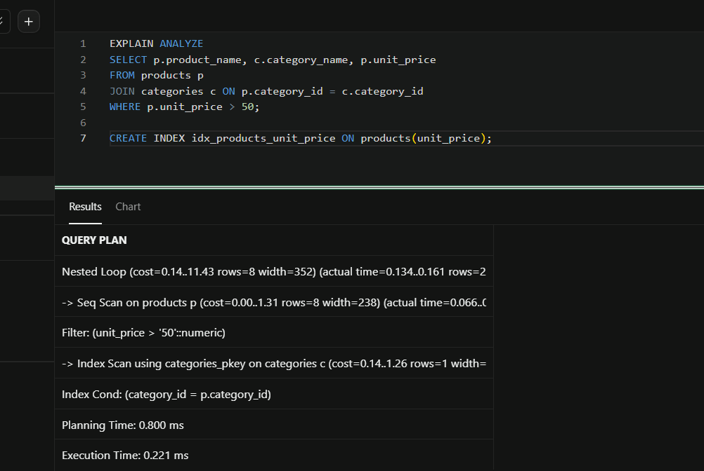
Пояснення: Я порівняла два різні підходи для вибірки топ-значень. На практиці я переконалася, що віконна функція ROW_NUMBER() працює в рази швидше, оскільки СУБД сканує таблицю в пам'яті лише один раз. Натомість корельований підзапит змушує систему повторно запускати вкладений цикл для кожного окремого рядка, що сильно знижує швидкість обробки даних на великих масивах.
Висновки
Самооцінка: 4
Обгрунтування самооцінки: У ході виконання лабораторної роботи мною було успішно реалізовано всі завдання достатнього рівня складності відповідно до моїх скріншотів. Я повністю опанувала на практиці складні типи з'єднань таблиць (INNER, LEFT, RIGHT, SELF JOIN), навчилася будувати агрегації з фільтрацією груп через HAVING. Також я успішно застосувала аналітичні віконні функції ранжування та зміщення (RANK, LAG, LEAD), провела аналіз продуктивності планів виконання через EXPLAIN ANALYZE та дослідила методи індексної оптимізації баз даних.
Контрольні запитання (Достатній рівень)
1. Яка різниця між операторами INNER JOIN, LEFT JOIN, RIGHT JOIN та FULL JOIN? Поясніть логіку обробки рядків для кожного типу.
• Відповідь:
	• INNER JOIN (Внутрішнє з'єднання) повертає лише ті рядки, для яких знайшлися збіги в обох таблицях. Якщо зв'язку немає, рядок відкидається.
	• LEFT JOIN (Ліве зовнішнє з'єднання) повертає всі записи з лівої таблиці, а з правої підтягує дані лише там, де є збіг. Якщо збігу немає, поля правої таблиці заповнюються значеннями NULL.
	• RIGHT JOIN (Праве зовнішнє з'єднання) працює навпаки: повертає всі записи з правої таблиці, а для лівої підставляє NULL, якщо збігів немає.
	• FULL JOIN (Повне з'єднання) об'єднує логіку лівого та правого з'єднань: воно виводить абсолютно всі рядки з обох таблиць, підставляючи NULL там, де пари не знайшлося.
2. Для чого використовується оператор self-join? Наведіть приклад бізнес-сценарію, коли таблицю потрібно з'єднати саму з собою.
• Відповідь: Self-join потрібен тоді, коли записи всередині однієї таблиці мають логічні зв'язки між собою (ієрархічні структури даних). Головний бізнес-сценарій — це дерево підпорядкованості працівників у компанії. Коли в одній таблиці employees у мене зберігаються і звичайні робітники, і їхні директори, то за допомогою self-join я пов'язую поле reports_to (код керівника) з полем employee_id цієї ж таблиці, щоб вивести кожну людину поруч із її босом.
3. У чому полягає різниця між використанням операторів WHERE та HAVING при фільтрації даних з агрегатними функціями?
• Відповідь: Оператор WHERE виконує фільтрацію окремих рядків до того, як база даних почне їх групувати та рахувати суми. У блоці WHERE категорично не можна писати агрегатні функції (на кшталт SUM чи COUNT). Натомість оператор HAVING виконує фільтрацію вже сформованих груп після відпрацювання GROUP BY, і він призначений саме для перевірки агрегованих значень (наприклад, відібрати тільки ті регіони, де загальна сума продажів SUM(sales) > 5000).
4. Що таке корельований підзапит (correlated subquery)? Чим він відрізняється від звичайного (некорельованого) підзапиту з точки зору продуктивності?
• Відповідь: Корельований підзапит — це вкладений запит, який використовує змінні або значення з основного (зовнішнього) запиту. Через це він не може виконатися окремо. З точки зору продуктивності він є дуже повільним, оскільки СУБД змушена запускати внутрішній підзапит заново для кожного окремого рядка зовнішньої таблиці. Звичайний підзапит виконується всього один раз, база запам'ятовує результат, і тому він працює значно ефективніше.
5. Поясніть логіку роботи віконних функцій (Window Functions). Чим вони принципово відрізняються від використання агрегатних функцій з GROUP BY?
• Відповідь: Віконні функції виконують обчислення над набором рядків, який пов'язаний із поточним рядком (це коло або "вікно" даних). Принципова відмінність від GROUP BY полягає в тому, що GROUP BY стискає (схлопує) всі рядки групи в один єдиний підсумковий рядок, втрачаючи детальну інформацію. Віконні функції прораховують аналітику (суми, ранги, зміщення), але при цьому зберігають усі початкові рядки вибірки недоторканими, не стискаючи результат.
6. У чому різниця між функціями ранжування RANK(), DENSE_RANK() та ROW_NUMBER()? Опишіть поведінку кожної функції при наявності однакових значень у сортуванні.
• Відповідь:
	• ROW_NUMBER() просто нумерує рядки по порядку (1, 2, 3, 4). Навіть якщо значення ціни однакові, вона все одно присвоїть їм різні послідовні номери.
	• RANK() присвоює однакові ранги для однакових значень, але при цьому пропускає наступні номери. Якщо два товари ділять 2-е місце, то порядок буде такий: 1, 2, 2, 4 (3-є місце зникає).
	• DENSE_RANK() також присвоює однакові ранги для однакових значень, але ніколи не робить пропусків у нумерації. Порядок буде щільним: 1, 2, 2, 3, 4.
7. Навіщо потрібні віконні функції LAG() та LEAD()? Наведіть приклад практичного завдання, яке важко вирішити без них.
• Відповідь: Ці функції потрібні для доступу до даних із сусідніх рядків без використання складних з'єднань таблиць. LAG() дозволяє зазирнути назад і взяти значення з попереднього рядка, а LEAD() — зазирнути вперед у наступний рядок. Практичне завдання, яке важко вирішити без них — це аналіз динаміки замовлень клієнта за часом. Якщо мені потрібно дізнатися, скільки днів пройшло між покупками клієнта, я за допомогою LAG(order_date) витягую дату попереднього замовлення в поточний рядок і легко рахую різницю в днях.
